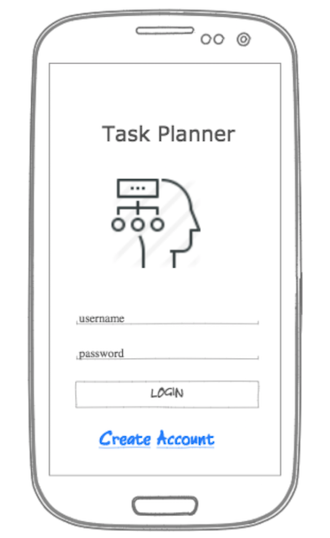
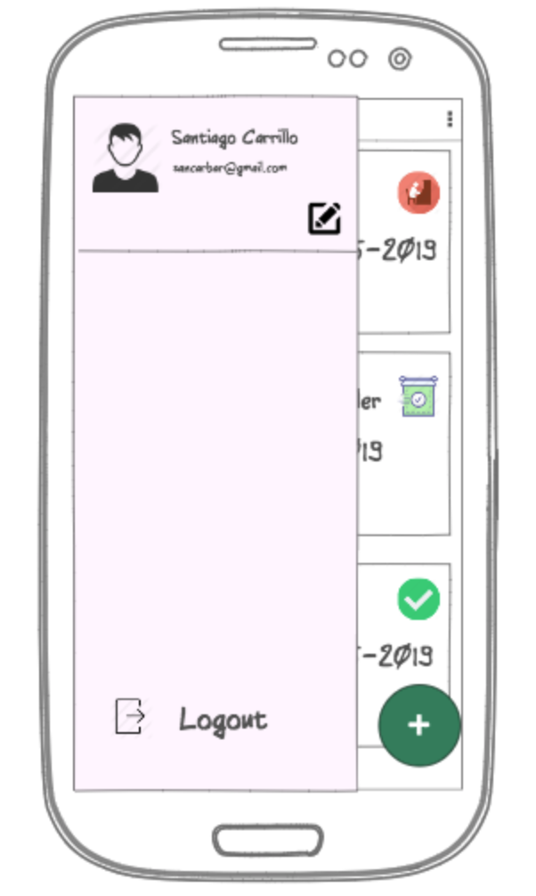
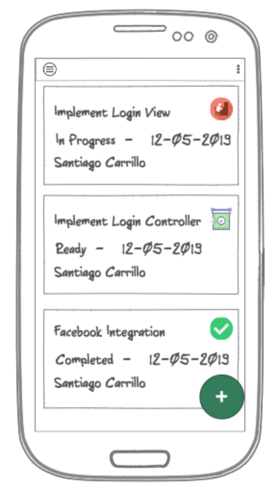

# Task Planner Project - Front End

1. Create a new React JS Project

    ```javascript
    npx create-react-app task-planner-app
    ```
2. Creat the Login.js component and the CSS if needed (use Material-UI library!)



3. Create a navigation drawer component with mocked user data (https://material-ui.com/demos/drawers/)



4. Create the main view that display the tasks using card layouts (https://material-ui.com/demos/cards/). 
    This will be your model to represent a task:
  ```javascript
       {
    	"description": "some description text ",
    	"responsible": {
    		"name": "Santiago Carrillo",
    		"email": "sancarbar@gmail"
    	},
    	"status": "ready",
    	"dueDate": 156464645646
    }
```




5. Learn about service workers and Offline support: https://codelabs.developers.google.com/codelabs/offline/#0
6. Use what you just learn to make your App work Offline
